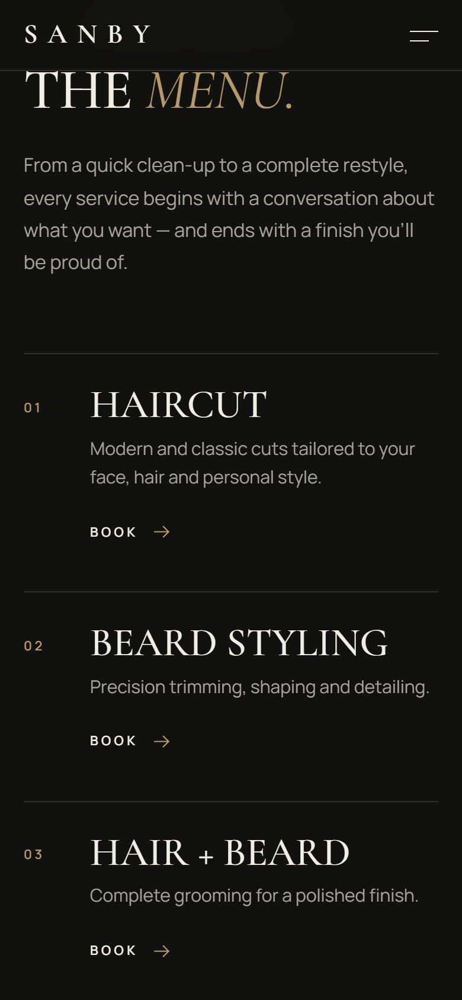
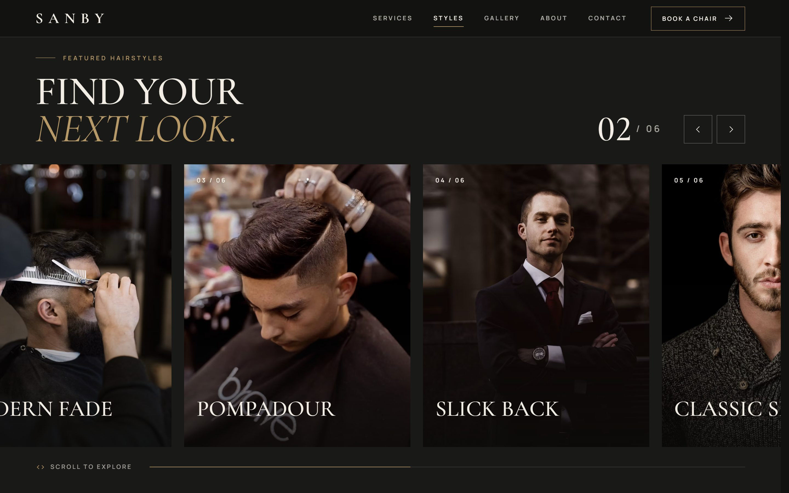
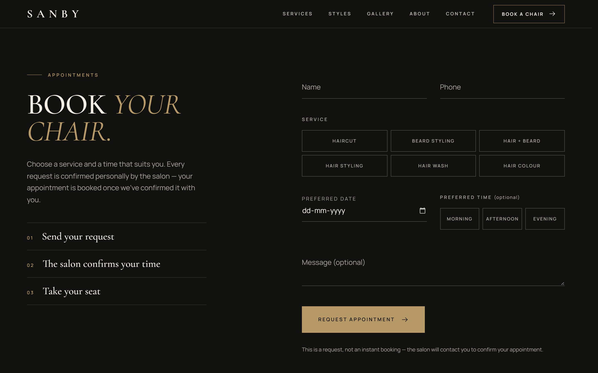

<div align="center">

# S A N B Y

**Sharp cuts. Clean style. Pure confidence.**

A cinematic, editorial website for a premium men's grooming studio —<br>
luxury barbershop × gentleman's club × fashion editorial.

[](https://sanby-salon.vercel.app/)


<br>


</div>

<br>

## ✦ Overview

Sanby is a single-page site built to feel like a brand, not a template: charcoal and warm ivory with a single muted-brass accent, large Cormorant Garamond headlines, full-bleed photography and asymmetric editorial layouts. Motion is slow and deliberate — you notice the quality, not the animation library.

Everything leads to one action: **Book a Chair**.

<table>
  <tr>
    <td width="33%"></td>
    <td width="33%"></td>
    <td width="33%"></td>
  </tr>
  <tr>
    <td align="center"><sub>Hero</sub></td>
    <td align="center"><sub>Signature services</sub></td>
    <td align="center"><sub>Full-screen menu</sub></td>
  </tr>
</table>

## ✦ The page

| Section | What makes it work |
|---|---|
| 🎬 **Cinematic hero** | Full-screen photograph that fades up and slowly settles, then the headline reveals line by line. Drifts and zooms gently as you scroll away. Branded scissor preloader on the first visit of a session. |
| 🧭 **Navigation** | Transparent over the hero, then dark, blurred and slimmer on scroll, with a brass marker on the current section. Phones get a full-screen menu with large numbered links. |
| ✂️ **Signature services** | A large editorial list, not six cards. On desktop the photograph on the right follows the row you point at. Every row pre-selects its service in the booking form. |
| 💈 **Featured hairstyles** | On desktop the row slides sideways as you scroll down, with a live `01 / 06` counter. Phones and tablets get a native swipe carousel. Any style opens full-screen with **Book this look**. |
| 🪑 **The Sanby experience** | A sticky photograph that changes as each step — Consultation, Precision Cut, Detail & Finish — comes into focus. |
| ↔️ **Before / after** | Large comparison slider for mouse, touch and keyboard, with a slow pulse on the handle until it's first used. Tagged "Sample imagery" on the photo itself until a real client pair is supplied. |
| 🖼️ **Gallery** | Editorial mosaic of mixed sizes with a lazy-loaded full-screen viewer (arrow keys, swipe, Esc). |
| ⭐ **Reviews** | One featured quote set large, the rest in a sideways row. Driven by config, and labelled as samples (no star ratings) until verified reviews are added. |
| 📅 **Booking** | Photographic call to action, then a request form with service and time choices, inline validation and clear "the salon will confirm" messaging. Optional **Book through WhatsApp**. |
| 📍 **Visit Sanby** | Contact details, map and oversized opening hours — all from config. |

<details>
<summary><b>More screenshots</b></summary>
<br>







</details>

## ✦ Built with care

- **📱 Phone-first details:** a sticky **Book a Chair** button that steps aside over the form, contact details and footer; 44px touch targets; no horizontal overflow from 320px up.
- **♿ Accessible:** semantic HTML and a logical heading outline, visible focus states, labelled fields and radio groups, a keyboard-operable slider, carousel and viewer, and a skip link. No axe-core violations at WCAG 2.2 AA.
- **🌙 Respects reduced motion:** with `prefers-reduced-motion` there's no preloader, parallax, sideways scrolling or cursor effects — content simply fades in.
- **⚡ Fast:** transform and opacity animations only, sticky CSS rather than JS pinning, lazy-loaded images with art-directed AVIF/WebP `srcset`, self-hosted variable fonts, and a viewer that downloads only when first opened. Layout shift ≈ 0.
- **🔍 SEO-ready:** title, description, Open Graph and X tags, canonical URL, `robots.txt`, `sitemap.xml`, and `HairSalon` structured data built from confirmed details only.
- **🙅 Makes nothing up:** unknown business details show as clearly marked placeholders until they're provided.

## ✦ Getting started

```bash
npm install
npm run dev       # http://localhost:5173
npm run build     # production build in dist/ (+ robots.txt, sitemap.xml)
npm run preview   # serve the production build locally
```

## ✦ Configuration

All business details live in one file: **[`site.config.js`](site.config.js)**. Leave a value empty (`''`) until it's confirmed, and the site shows a dashed *"… to be added"* placeholder instead.

```js
export default {
  name: 'Sanby Salon',
  address: '',          // one line
  addressDetails: { locality: '', region: '', postalCode: '', country: '' }, // structured data only
  phone: '',            // '+<country code> <number>'
  whatsapp: '',
  instagram: '',        // handle, without @
  facebook: '',         // full URL
  hours: [{ days: 'Mon – Sat', time: '', schema: '' }, { days: 'Sunday', time: '', schema: '' }],
  figures: { confirmed: false, items: [/* { value, suffix, star, label } */] },
  map: { link: '', embed: '' },
  services: { 'haircut': { duration: '', price: '' }, /* … */ },
  reviews: { verified: false, link: '', items: [/* { quote, name, service, rating } */] },
  booking: { endpoint: '' }, // e.g. a Formspree URL
};
```

Filling a value in automatically updates the page at build time:

| Setting | Effect |
|---|---|
| `phone` | Tap-to-call links, a **Call** button under the contact details, **Call the Salon** in the booking band, and the number in the mobile menu |
| `whatsapp` | A **WhatsApp** button and **Book through WhatsApp** in the form (opens WhatsApp with the request pre-filled) |
| `instagram` | Linked handle in the contact details, footer and mobile menu |
| `map.link` / `map.embed` | A **Directions** button, and the "Map coming soon" panel becomes a Google Map |
| `hours` | The opening hours table; `schema` (e.g. `Mo-Sa 10:00-20:00`) adds them to the structured data |
| `figures` | The "at a glance" numbers in About. Shown with a "To be confirmed" note until `confirmed: true` |
| `addressDetails` | City, region, postcode and country for the structured data |
| `services` | A duration and/or price under each service, e.g. `45 min · From 500` |
| `reviews` | The featured quote and the review row. Set `verified: true` only for real reviews — that removes the "Sample" labels and shows star ratings; `link` adds **Read all reviews** |
| `booking.endpoint` | The form sends requests there, with loading, success and error states. Until an endpoint or `whatsapp` is set, the form says up front that online requests aren't connected yet |
| everything above | Confirmed details are added to the structured data |

> [!NOTE]
> Restart `npm run dev` after editing `site.config.js`.

## ✦ Before launch

- [ ] Fill in the business details in `site.config.js`
- [ ] Replace the sample reviews in `site.config.js` → `reviews` with real, verified ones, then set `verified: true`
- [ ] Confirm the figures (5+ years, 1000+ clients, 4.9 rating) in `site.config.js` → `figures`, then set `confirmed: true`
- [ ] Connect the booking form: set `booking.endpoint` (e.g. Formspree) and/or `whatsapp` in `site.config.js`
- [ ] Swap in a real before/after pair (same client, with permission) in `#transformation`
- [ ] Replace the placeholder photography with the salon's own
- [ ] If the site moves to its own domain, update `.env` → `SITE_URL` (canonical URL, Open Graph, sitemap and robots)

### Images

The photos are Unsplash placeholders, given one consistent grade at build time (slightly warm, muted, a touch more contrast) so they read as a single shoot. In `index.html`, an image written as:

```html

```

is expanded into a responsive AVIF/WebP `srcset`, cropped to the `width`/`height` ratio. `<source data-img>` inside `<picture>` works the same way, for a different crop on phones. To use the salon's own photos, swap the IDs or replace the tags with local optimised files (e.g. `public/images/*.webp`) with explicit `width` and `height`.

## ✦ Project structure

```
├── index.html               Semantic markup for every section, from navigation to footer
├── site.config.js           Business details and reviews (the only file most edits need)
├── vite.config.js           Build plugins: responsive images, config → HTML, SEO files
├── public/                  Favicon
└── src/
    ├── main.js              Entry point: fonts, styles, module setup
    ├── styles/              base (tokens) · components · nav-hero · sections · contact-footer · loader
    └── js/
        ├── motion.js        Shared easing, durations, reduced-motion / pointer checks
        ├── loader.js        Branded preloader
        ├── animations.js    Hero, scroll reveals, separators, counters, parallax, experience steps, wordmark
        ├── nav.js           Navigation, active-section marker, mobile menu, smooth in-page links
        ├── service-preview.js  Service image panel + pre-selecting services in the form
        ├── styles-rail.js   Featured hairstyles: sideways scroll on desktop
        ├── scroller.js      Carousels: native swipe + mouse drag with momentum
        ├── compare.js       Before/after slider
        ├── pointer.js       Cursor ring + magnetic buttons (desktop)
        ├── lightbox*.js     Lazy-loaded image viewer
        ├── booking-form.js  Validation and delivery (endpoint / WhatsApp / not connected)
        ├── sticky-cta.js    Phone-only sticky booking button
        └── back-to-top.js   Floating back-to-top with progress ring
```

<details>
<summary><b>Motion notes for developers</b></summary>
<br>

- All timing lives in `src/js/motion.js` (GSAP) and the `--ease-out` / `--dur-*` tokens in `src/styles/base.css` (CSS). The site-wide ease is `cubic-bezier(0.16, 1, 0.3, 1)`: micro interactions 150–250ms, UI transitions 300–450ms, editorial reveals 600–900ms.
- Reveal variants:
  - `data-reveal`: fades up
  - `data-reveal="mask"`: wipes an image open
  - `data-reveal="fade"`: fades in place — use it on anything a link scrolls to (like the booking form), so the browser doesn't aim at it while it's still offset
  - `data-split`: headline revealed line by line
  - `data-line`: thin separator that draws in
- Content is hidden before animating only while the script is running. A fallback timer reveals everything if the script never loads.

</details>

<br>

<div align="center">
<sub>Designed and built for <b>Sanby Salon</b> &nbsp;·&nbsp; Modern grooming for the modern man.</sub>
</div>
