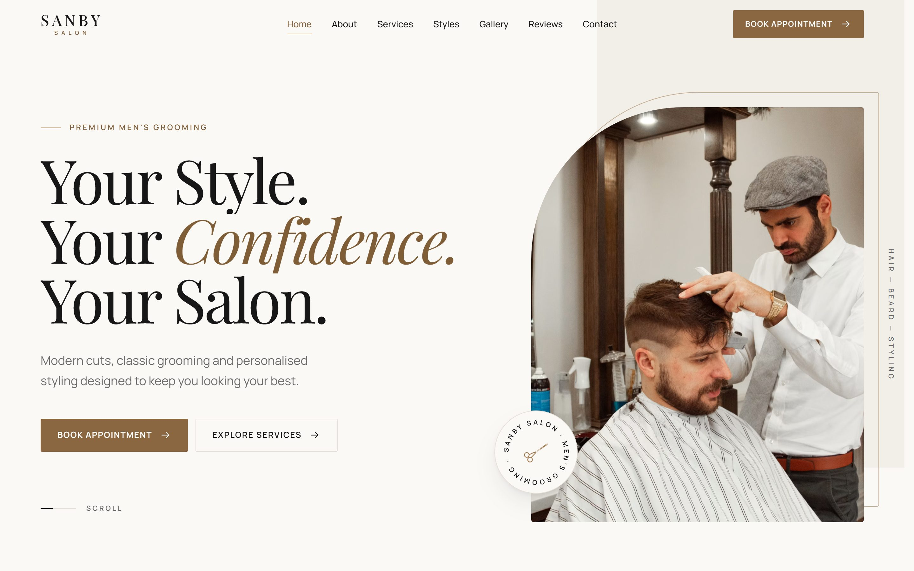
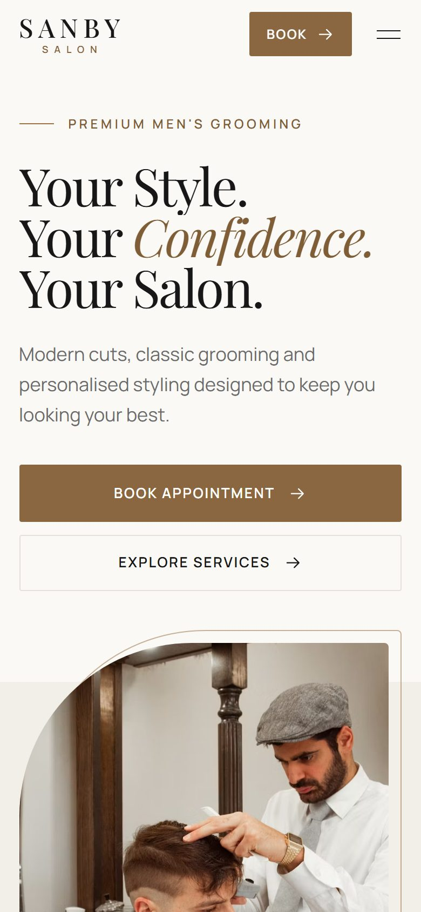
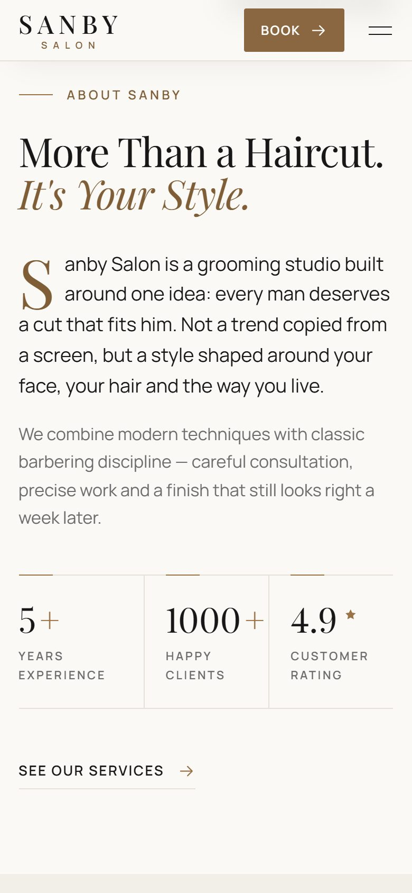
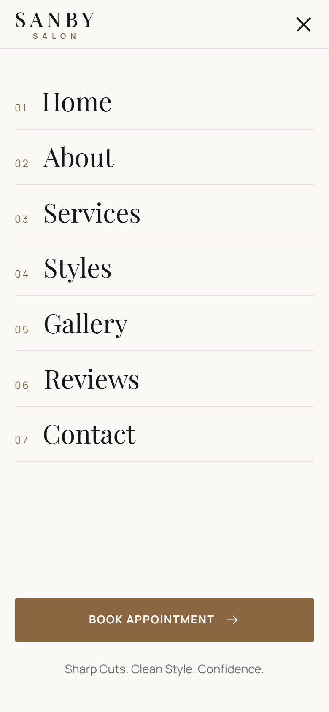
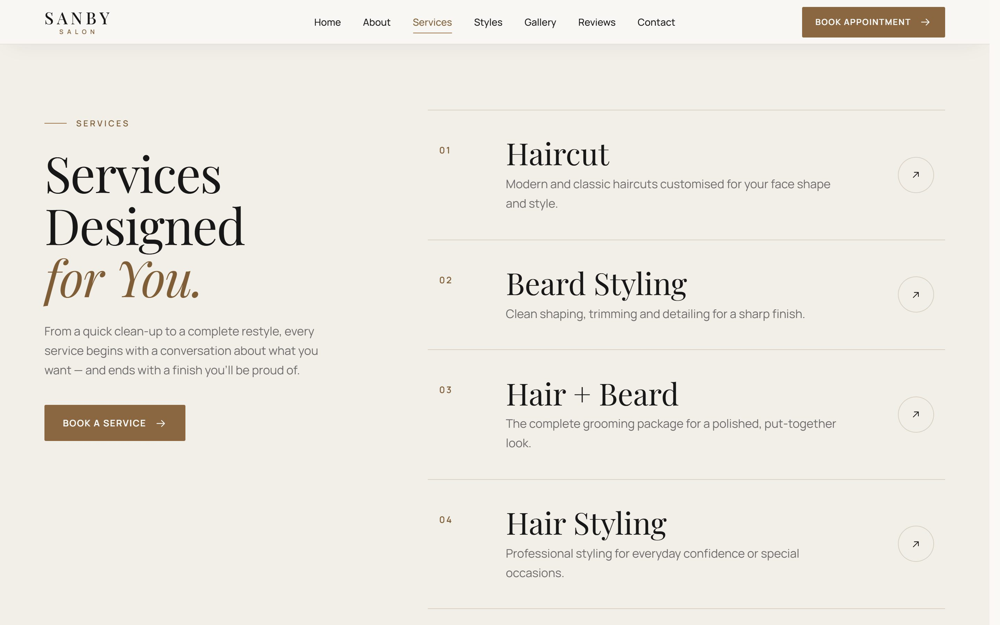
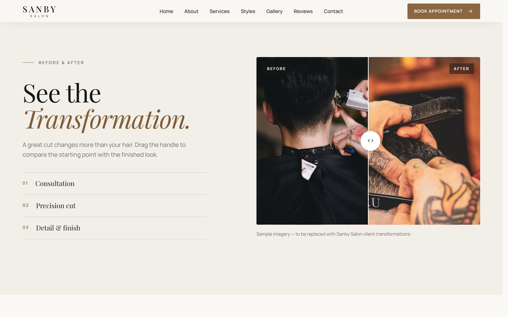
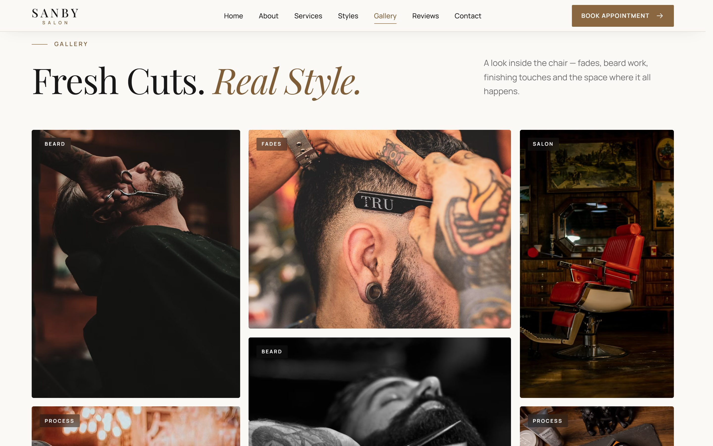

<div align="center">

# S A N B Y &nbsp; S A L O N

**Sharp Cuts. Clean Style. Confidence.**

A cinematic, editorial website for a premium men's grooming studio.

[](https://dynamic-sprite-c45f1e.netlify.app/)


<br>



</div>

<br>

## ✦ Overview

Sanby Salon is a single-page website that feels like a luxury barbershop crossed with an editorial fashion magazine: warm ivory and charcoal, Playfair Display headlines, generous whitespace and deliberate, unhurried motion.

Everything leads to one action: **Book Appointment**.

<table>
  <tr>
    <td width="33%"></td>
    <td width="33%"></td>
    <td width="33%"></td>
  </tr>
  <tr>
    <td align="center"><sub>Hero</sub></td>
    <td align="center"><sub>About &amp; stats</sub></td>
    <td align="center"><sub>Mobile menu</sub></td>
  </tr>
</table>

## ✦ Features

| | |
|---|---|
| 🎬 **Cinematic intro** | Branded preloader with real progress (fonts + hero photo), then a staggered hero entrance: masked image reveal, line-by-line headline, then the call to action. Plays once per session. |
| 🧭 **Smart navigation** | Transparent at the top, compact and frosted on scroll. A sliding indicator marks the current section. Full-screen mobile menu with focus trap and scroll lock. |
| ✂️ **Services** | Editorial list with hover transitions and a cursor-following image preview on desktop. Clicking a service pre-selects it in the booking form. |
| 💈 **Trending styles** | Horizontal carousel with native touch swipe, mouse drag with momentum, and prev/next buttons. |
| ↔️ **Before / after** | Comparison slider that works with mouse, touch and keyboard, and gives one gentle "try me" hint on first view. |
| 🖼️ **Gallery** | Mixed-size editorial grid with category tags and a lazy-loaded lightbox (arrow keys, swipe, Esc). |
| 📅 **Booking form** | Floating labels, inline validation, and loading / success / error states. Sends to a form endpoint or WhatsApp, whichever you configure. |
| 🖱️ **Micro-interactions** | Subtle cursor ring on desktop, magnetic buttons, arrow and underline transitions, a scroll-reactive service ribbon, and a barber-themed footer wordmark. |

<details>
<summary><b>More screenshots</b></summary>
<br>





</details>

## ✦ Built with care

- **♿ Accessible:** semantic HTML, a logical heading order, visible focus states, labelled form fields, a keyboard-operable slider and lightbox, and a skip link.
- **🌙 Respects reduced motion:** with `prefers-reduced-motion`, there's no preloader, parallax or movement; content simply fades in.
- **⚡ Fast:** transform and opacity animations only, lazy-loaded images with responsive AVIF/WebP `srcset`, self-hosted variable fonts, and a lightbox that downloads only when first opened. Layout shift is ~0.
- **🔍 SEO-ready:** meta and social tags, canonical URL, `robots.txt`, `sitemap.xml`, and `HairSalon` structured data generated from confirmed details only.
- **🙅 Makes nothing up:** unknown business details show as clearly marked placeholders until they're provided.

## ✦ Getting started

```bash
npm install
npm run dev       # http://localhost:5173
npm run build     # production build in dist/ (+ robots.txt, sitemap.xml)
npm run preview   # serve the production build locally
```

## ✦ Configuration

All business details live in one file: **[`site.config.js`](site.config.js)**. Leave a value empty (`''`) until it's confirmed, and the site shows a dashed *"… to be added"* placeholder instead.

```js
export default {
  name: 'Sanby Salon',
  address: '',          // one line
  phone: '',            // '+<country code> <number>'
  whatsapp: '',
  instagram: '',        // handle, without @
  facebook: '',         // full URL
  hours: [{ days: 'Mon – Sat', time: '' }, { days: 'Sunday', time: '' }],
  map: { link: '', embed: '' },
  services: { 'haircut': { duration: '', price: '' }, /* … */ },
  booking: { endpoint: '' }, // e.g. a Formspree URL
};
```

Filling a value in automatically updates the page at build time:

| Setting | Effect |
|---|---|
| `phone` | "Call Salon" becomes a `tel:` link, and a **Call** button appears under the contact details |
| `whatsapp` | Adds a **WhatsApp** button. With no `booking.endpoint`, the form opens WhatsApp with the request pre-filled |
| `map.link` / `map.embed` | Adds a **Directions** button and swaps the "Map coming soon" panel for a Google Map |
| `services` | Shows a duration and/or price under each service, e.g. `45 min · From 500` |
| `booking.endpoint` | The form sends requests there, with loading, success and error states |
| everything above | Confirmed details are added to the structured data |

> [!NOTE]
> Restart `npm run dev` after editing `site.config.js`.

## ✦ Before launch

- [ ] Fill in the business details in `site.config.js`
- [ ] Set the real domain in `.env` → `SITE_URL` (used for the canonical URL, Open Graph, sitemap and robots)
- [ ] Confirm the stats (5+ years, 1000+ clients, 4.9 rating) in `index.html` → `[data-stats]`
- [ ] Replace the sample reviews in `#reviews` with real, verified ones, and remove the `.reviews__notice` line
- [ ] Swap in a real before/after pair (same client, with permission) in `#transformation`
- [ ] Replace the placeholder photography with the salon's own

### Images

The photos are Unsplash placeholders. In `index.html`, an image written as:

```html

```

is expanded at build time into a responsive AVIF/WebP `srcset`, cropped to the `width`/`height` ratio. To use the salon's own photos, swap the IDs or replace the tags with local optimised files (e.g. `public/images/*.webp`) with explicit `width` and `height`.

## ✦ Project structure

```
├── index.html               Semantic markup for every section, from navbar to footer
├── site.config.js           Business details (the only file most edits need)
├── vite.config.js           Build plugins: responsive images, config → HTML, SEO files
├── public/                  Favicon
└── src/
    ├── main.js              Entry point: fonts, styles, module setup
    ├── styles/              base (tokens) · components · nav-hero · sections · contact-footer · loader
    └── js/
        ├── motion.js        Shared eases, durations, reduced-motion / pointer checks
        ├── loader.js        Branded preloader
        ├── animations.js    Hero entrance, scroll reveals, counters, parallax, marquee, wordmark
        ├── nav.js           Sticky nav, active-section indicator, mobile menu
        ├── scroller.js      Carousels: native swipe + mouse drag with momentum
        ├── compare.js       Before/after slider
        ├── service-preview.js  Cursor-following service images (desktop)
        ├── pointer.js       Cursor ring + magnetic buttons (desktop)
        ├── lightbox*.js     Lazy-loaded image viewer
        ├── booking-form.js  Validation and delivery
        └── back-to-top.js   Floating back-to-top with progress ring
```

<details>
<summary><b>Motion notes for developers</b></summary>
<br>

- All timing lives in `src/js/motion.js`, so the feel of the whole site can be tuned in one place.
- Reveal variants:
  - `data-reveal`: fades up
  - `data-reveal="mask"`: wipes an image open
  - `data-reveal="panel"`: opens the booking panel on scroll
  - `data-reveal="fade"`: fades in place
- Use `data-reveal="fade"` on anything a link scrolls to (like the booking form). Otherwise the browser aims at it while it's still offset and stops short.
- Content is hidden before animating only while the script is running. A fallback timer reveals everything if the script never loads.

</details>

<br>

<div align="center">
<sub>Designed and built for <b>Sanby Salon</b> &nbsp;·&nbsp; Modern grooming for the modern man.</sub>
</div>
